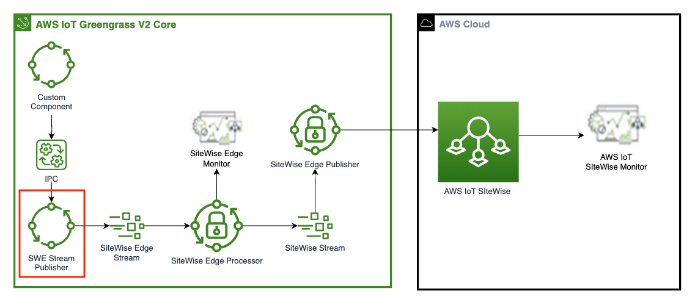

## AWS IoT SiteWise Stream Publisher

This component monitors the local MQTT topic `local/swe_stream/publish` and pushes the incoming data to the `SiteWise_Edge_Stream` stream. 

**Note:** To enable features offered by  **AWS IoT SiteWise Edge**, please enable the **Data Processing Pack** when configureing the **AWS IoT Greengrass Core** as an **AWS IoT SiteWise Edge Gateway**. 

The incoming message to the topic must be of the following format: 

```
{
    "timestamp": "1680869520.993",
    "alias": "Gnn6000_21-101-AGICODE",
    "value": 4.0,
    "quality": "GOOD"
}
```
This component takes away the heavy lifting of creating the sitewise streams and adding data to it. 

You can also change the name of the stream from `SiteWise_Edge_Stream` to `SiteWise_Stream` if you want to send data directly to the cloud. 

 

## Downloading this component
You can either clone this repo with git, or download this component as a zip file.  

NOTE THAT THE FOLDER IN WHICH YOU CLONE OR UNZIP THIS COMPONENT NEEDS TO BE CALLED ```aws-greengrass-labs-sitewise-stream-publisher``` FOR GDK TO WORK PROPERLY

## Installing dependencies
It is recommended to create a virtual environment to install dependencies. To do so, run the following commands in the root folder of this repo:  
```bash
 python3 -m venv .venv
 source ./.venv/bin/activate
```

This component can be built with [GDK](https://docs.aws.amazon.com/greengrass/v2/developerguide/gdk-cli-configuration-file.html)

```bash
python3 -m pip install -U git+https://github.com/aws-greengrass/aws-greengrass-gdk-cli.git@v1.2.3
```
## Build

Before building the component, you will need to update the gdk-config.json file, replacing the bucket and region placeholder.
```     .
        .
        "publish": {
            "bucket": "<PLACEHOLDER BUCKET HERE>",
            "region": "<PLACEHOLDER REGION>"
        }
        .
        .
```
The bucket is where the component artefact will be uploaded when you publish the component, and region is the region where the greengrass component will be created.

Once this is done, you can build the component with the following command:
```
gdk component build
```
## Publish
Before you can deploy **aws.greengrass.labs.sitewise.stream.publisher** component to your device, you first need to publish your component.
This can be done with the following command:
```
gdk component publish
```

You should now be able to see the **aws.greengrass.labs.sitewise.stream.publisher** component in the *Greengrass->component* section of the AWS console.

It can now be included in a Greengrass deployment and pushed to your device.

## Configuration

This component provides the following configuration parameters when it is deployed:

```
StreamName: "SiteWise_Edge_Stream"
topicName: "local/swe_stream/publish"
```

You can chose any value for **topicName** depending on your application, however, valid examples for **StreamName** are:
```
SiteWise_Edge_Stream
SiteWise_Stream
``` 

Further, please make sure that the  **GreengrassV2TokenExchangeRole** IAM Role has access to AWS IoT Sitewise as mentioned in the Requirements documentation for [AWS IoT SiteWise with Edge Processing](https://docs.aws.amazon.com/iot-sitewise/latest/userguide/edge-setup.html)

## Local log file
This component uses the following local log file:
```
/greengrass/v2/logs/aws.greengrass.labs.sitewise.stream.publisher.log
```

## Incoming Topic Payload Considerations

Expected paylaod structure is the following:

```
{
    "timestamp": "1680869520.993",
    "alias": "Gnn6000_21-101-AGICODE",
    "value": 4.0,
    "quality": "GOOD"
}
```

1. Please note that the value of the key: **"timestamp"** should be a **STRING**, and should follow the epoch seconds format. 
    Example python code: 

    import time
    timestamp= str(time.time())

2. Value of the key: **"value"** should be a **FLOAT**.
    Example python code: 

    value= float(4)
    
3. Value of the key: **"alias"** should be a **STRING**, and this alias should be associated with an **ASSET** in **AWS IoT SiteWise**.
4. Value of the key: **"quality"** should be a **STRING**, and one of 3 possible values: **GOOD | BAD | UNCERTAIN**
    Example python code: 
    
    quality= "UNCERTAIN"

## Contributing and Security

See [CONTRIBUTING](CONTRIBUTING.md#security-issue-notifications) for more information.

## License

This library is licensed under the Apache-2.0 License. See the LICENSE file.
